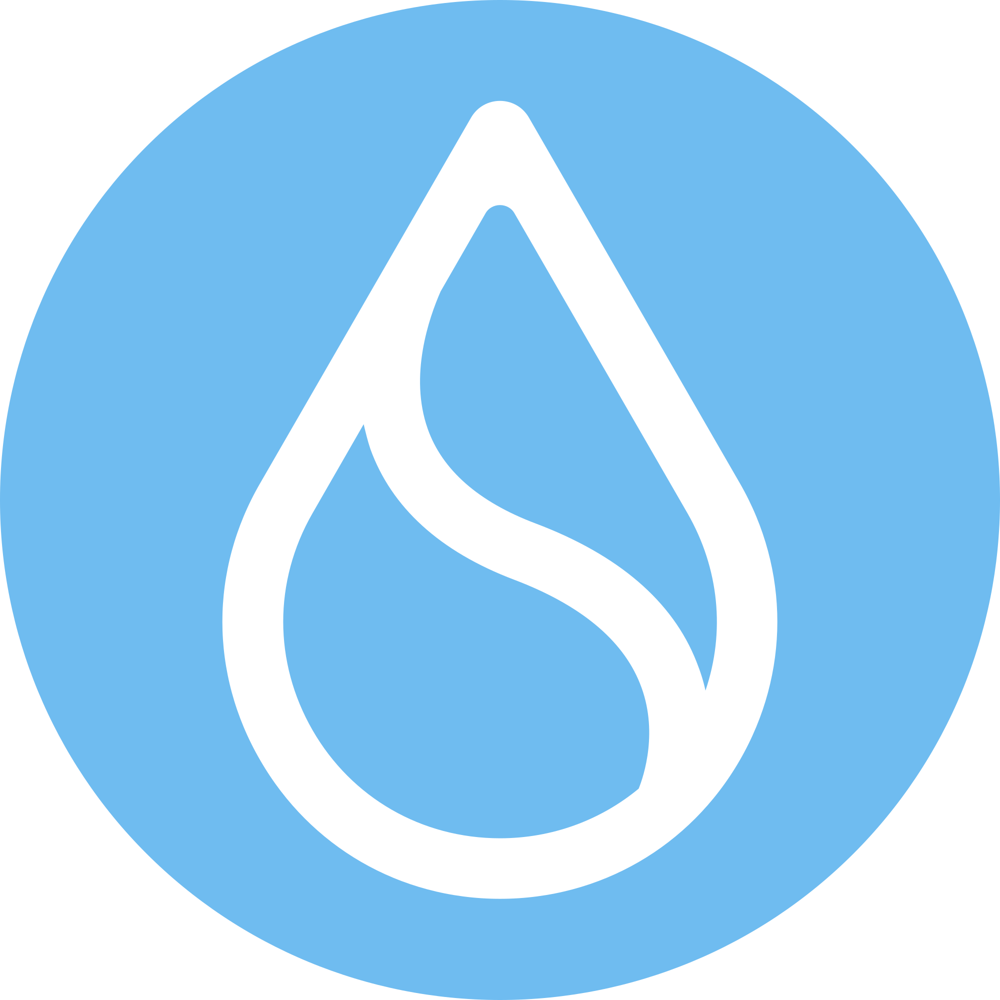

# Nice to meet you
As a blockchain developer, I write smart contrat, develop token projects and launch NFTs, trade with technique.

## Blockchain I work with

<table align="center">

<tr>
  <td align="center" width="90">
    
     Solana
  </td>
   <td align="center" width="90">
    
     Sui
  </td>
  <td align="center" width="90">
    
     Ethereum
  </td>
  <td align="center" width="90">
    
     Binance
  </td>
  <td align="center" width="90">
    
     Base
  </td>
  <td align="center" width="90">
    
     Bitcoin
  </td>
  <td align="center" width="90">
    
     Ton
  </td>
</tr>
</table>

## Main Languages of everyday use

 

<table align="center">
<!-- skill -->
  <tr>
    <td align="center" width="90">
      
       Rust
    </td>
        <td align="center" width="90">
      
       Move
    </td>
     <td align="center" width="90">
      
       GoLang
    </td>
    <td align="center" width="90">
      
       Typescript
    </td>
    <td align="center" width="90">
      
       Javascript
    </td>
     <td align="center" width="90">
      
       Solidity
    </td>
    <td align="center" width="90">
      
       Python
    </td>
    <td align="center" width="90">
      
       C++
    </td>

  </tr>
  <!-- network -->
</table>

## My daily life is connected with

<table align="center">
<tr>
<td align="center" width="90">
      
       Anchor
    </td>
     <td align="center" width="90">
      
       Remix
    </td>
    <td align="center" width="90">
      
       Nodejs
    </td>
    <td align="center" width="90">
      
       Express
    </td>
    <td align="center" width="90">
      
       React
    </td>
    <td align="center" width="90">
      
       Next.js
    </td>
    <td align="center" width="90">
      
       MongoDB
    </td>
    <td align="center" width="90">
      
       PostgreSQL
    </td>
    <td align="center" width="90">
      
       MySQL
    </td>
  </tr>
  </table>

## Project I worked with 

<table align="center">
  <tr>
    <td align="center" width="90">
      
       Raydium
    </td>
    <td align="center" width="90">
      
       Pumpfun
    </td>
    <td align="center" width="90">
      
       Pumpswap
    </td>
    <td align="center" width="90">
      
       Meteora
    </td>
    <td align="center" width="90">
      
       Launchlab
    </td>
    <td align="center" width="90">
      
       Bluefin
    </td>
    <td align="center" width="90">
      
       Cetus
    </td>
    <td align="center" width="90">
      
       Nyla AI
    </td>
    <td align="center" width="90">
      
       Agent S
    </td>
  </tr>
  
</table>
